# SDG Indicator Text Classification (Group Assignment 2)

Multi-label text classifier for **SDG Goal 3** indicators using the Devex dataset (~3,000 training documents, 27 label classes).

**Primary evaluation metric:** Hamming loss (lower is better)

---

## Repository contents

| File | Purpose |
|------|---------|
| `SGD_indicator.ipynb` | **Complete pipeline** — EDA, preprocessing, 10 experiments, test predictions |
| `Devex_train.csv` | Training data (with labels) |
| `Devex_test_questions.csv` | Test data (no labels) |
| `requirements.txt` | Python dependencies |
| `results/` | Generated after running the notebook (tables + figures for report) |

All model and embedding implementations live inside **`SGD_indicator.ipynb`** (Experiment configs in STEP 8).

---

## Google Colab (recommended)

1. Upload this repo (or upload `SGD_indicator.ipynb` + both CSV files) to Colab.
2. Open `SGD_indicator.ipynb`.
3. **Runtime → Run all** (first cell installs dependencies).

Outputs:

- `Devex_test_predictions_best.csv` — test predictions from best experiment
- `results/experiments_summary.csv` — experiment comparison table
- Figures under `results/` (see [Results](#results) below)

---

## Local setup

```bash
python3 -m venv myenv
source myenv/bin/activate   # Windows: myenv\Scripts\activate
pip install -r requirements.txt
jupyter notebook SGD_indicator.ipynb
```

Run all cells top to bottom.

---

## Experiments (STEP 8)

| Exp | Model | Features | What changed |
|-----|-------|----------|--------------|
| 1 | LogReg OvR | TF-IDF 15k | Baseline (cleaned text) |
| 2 | LogReg OvR | TF-IDF + Type prefix | Document type metadata |
| 3 | LogReg OvR | TF-IDF unigrams | No bigrams |
| 4 | LogReg OvR | TF-IDF 15k | Raw text (no HTML clean) |
| 5 | LogReg OvR | TF-IDF 15k | Threshold 0.35 |
| 6 | LinearSVC | TF-IDF 15k | Different classifier |
| 7 | LogReg OvR | TF-IDF + max_df | Drop very common terms |
| 8 | LinearSVC | TF-IDF + Type | Combine Exp 2 & 6 |
| 9 | LogReg (no class weight) | TF-IDF 15k | Imbalance handling ablation |
| 10 | LogReg OvR | TF-IDF 25k | Larger vocabulary |

---

## Generate test predictions

After **STEP 9**, the best validation experiment is retrained on full training data and saved to:

```
Devex_test_predictions_best.csv
```

Columns match the training format: `Unique ID`, `Type`, `Text`, `Label 1` … `Label 12`.

---

## Results

Figures are produced when you run the notebook (STEP 8–9 and evaluation cells). **Best model on validation:** Experiment 8 (LinearSVC + document Type prefix) — lowest Hamming loss (~0.052). See `results/experiments_summary.csv` for full metrics.

### Experiment comparison

| Artifact | Description |
|----------|-------------|
| `results/experiments_summary.csv` | Hamming loss, F1, and config for all 10 experiments |
| `results/experiment_comparison.png` | Bar chart comparing experiments (report figure) |

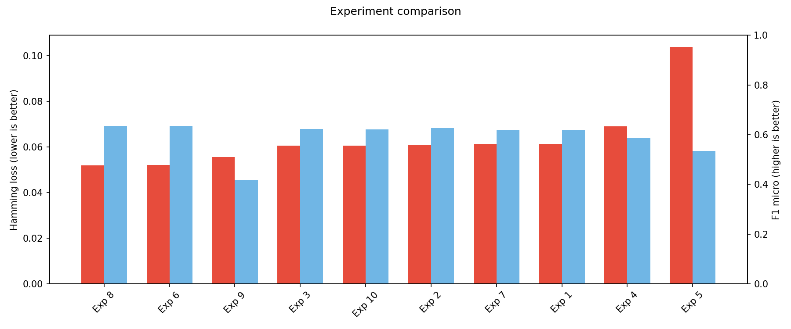

### Best model (Experiment 8)

| Artifact | Description |
|----------|-------------|
| `results/best_model_per_label_metrics.csv` | Per-label precision, recall, F1 |
| `results/best_model_per_label_f1.png` | F1 by label |
| `results/best_model_confusion_matrices.png` | Confusion matrices for top labels |
| `results/best_model_learning_curve.png` | Train vs validation loss by epoch |

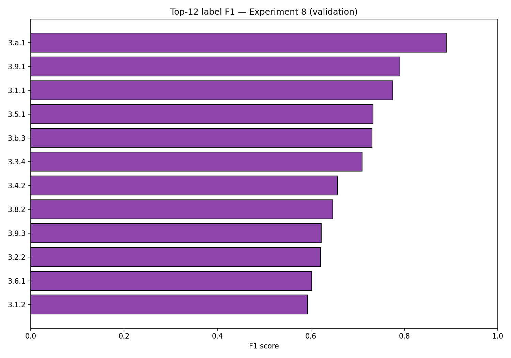

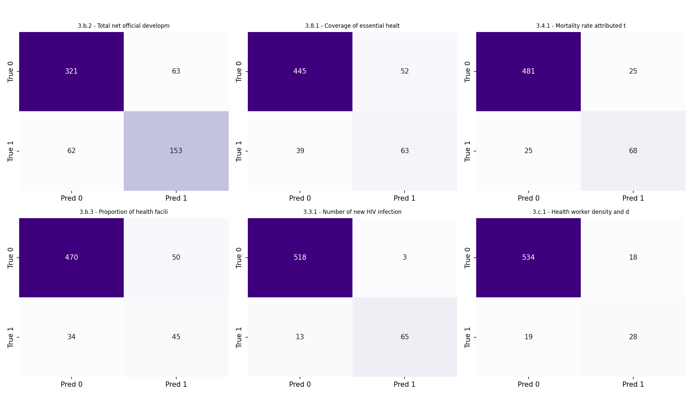

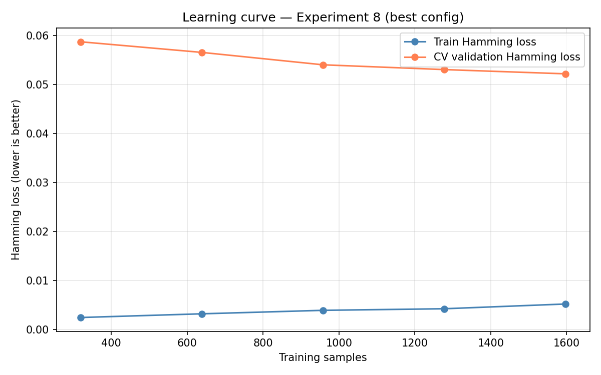

### Learning curves (all experiments)

| Artifact | Description |
|----------|-------------|
| `results/experiment1_learning_curve.png` | Baseline (Exp 1) learning curve |
| `results/learning_curves/all_experiments_overlay.png` | All runs on one plot |
| `results/learning_curves/all_experiments_grid.png` | Small multiples per experiment |

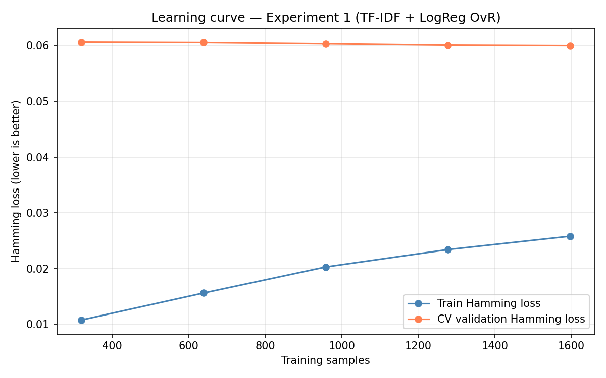

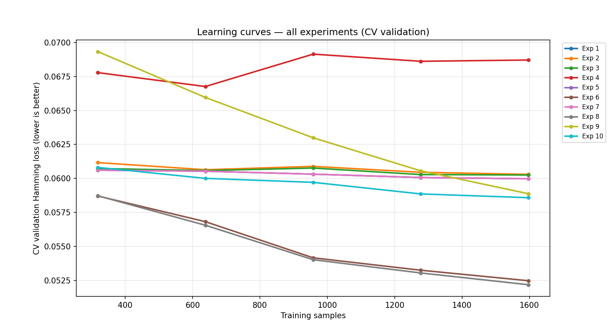

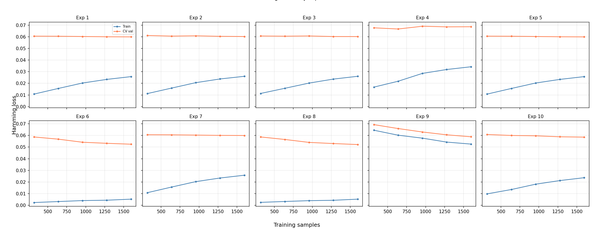

### Confusion matrices and F1 heatmap

Top-6 labels by validation support, one figure per experiment (`results/confusion_matrices/`).

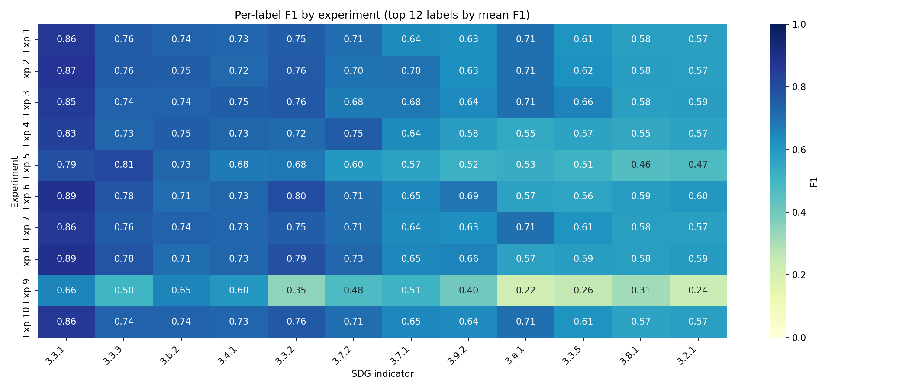

| Exp | Figure |
|-----|--------|
| 1 | 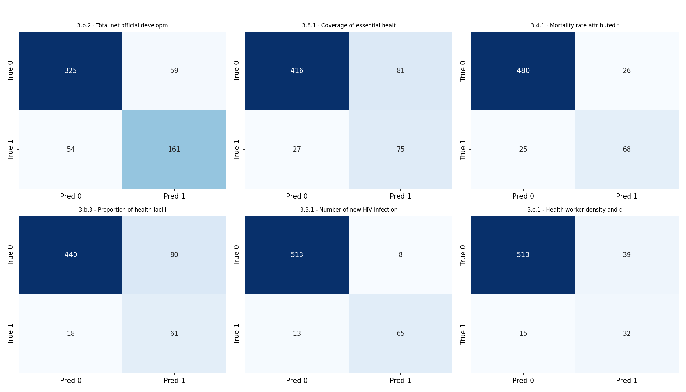 |
| 2 |  |
| 3 |  |
| 4 | 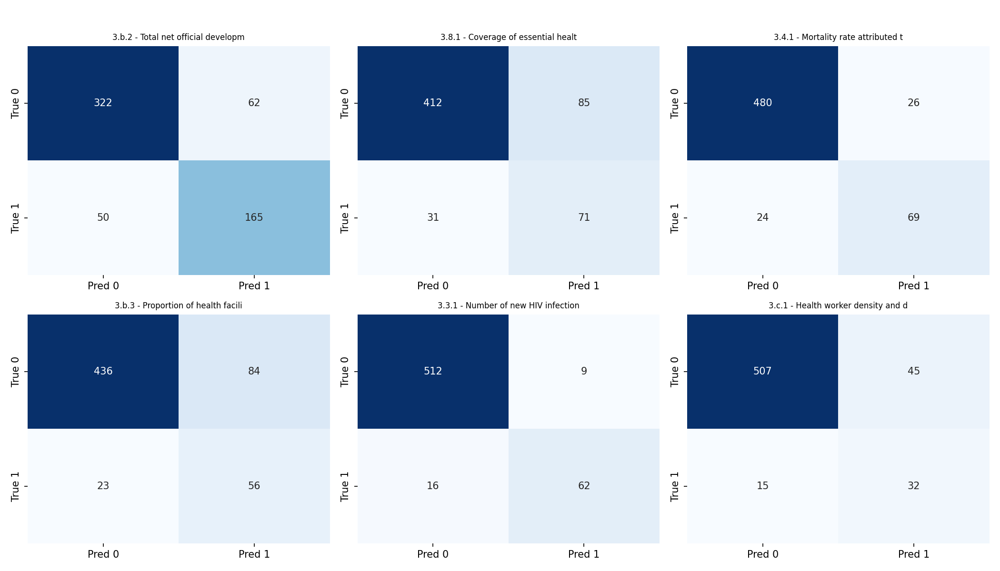 |
| 5 | 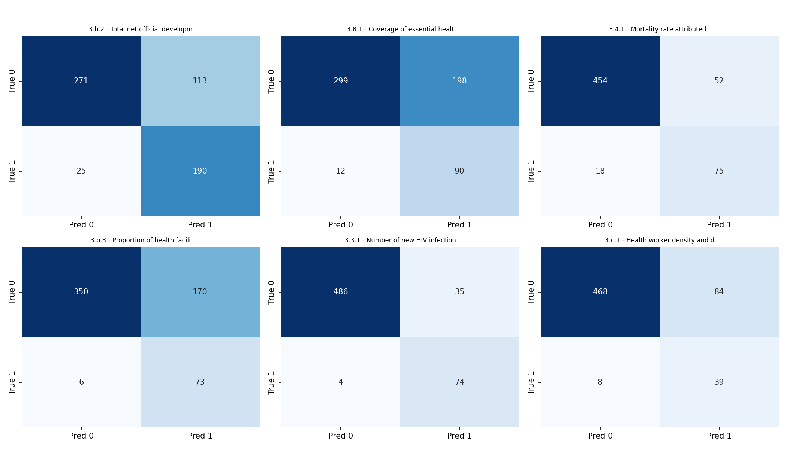 |
| 6 |  |
| 7 |  |
| 8 | 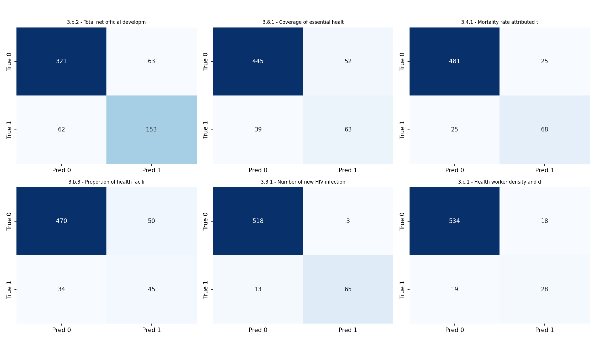 |
| 9 | 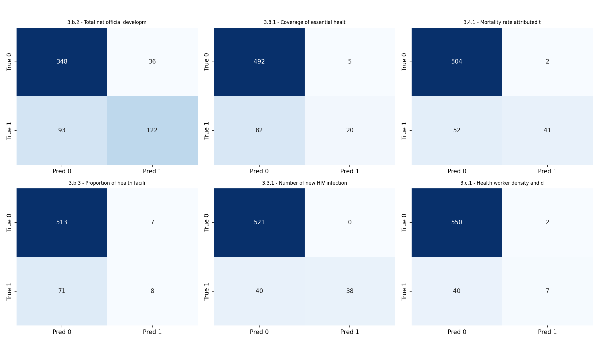 |
| 10 | 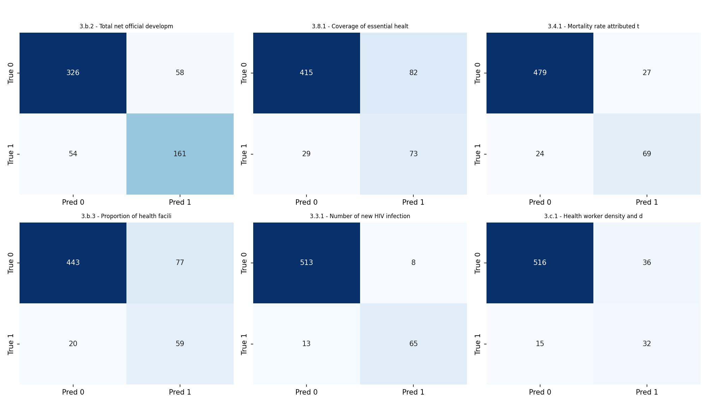 |
